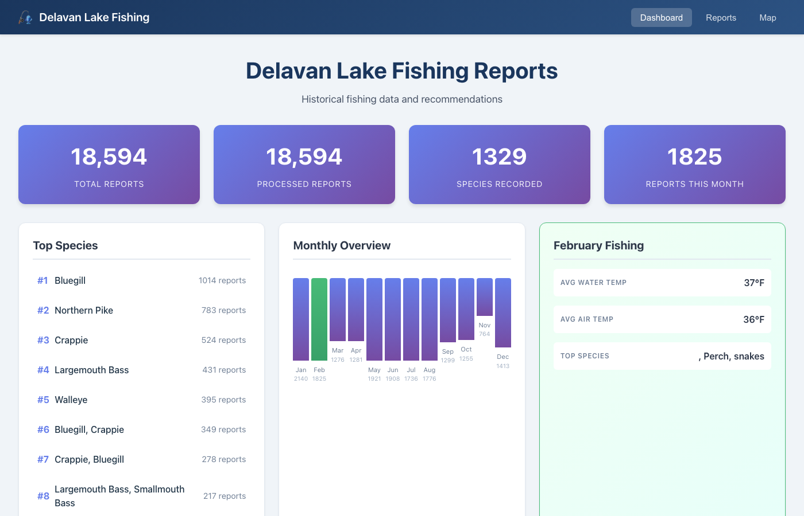
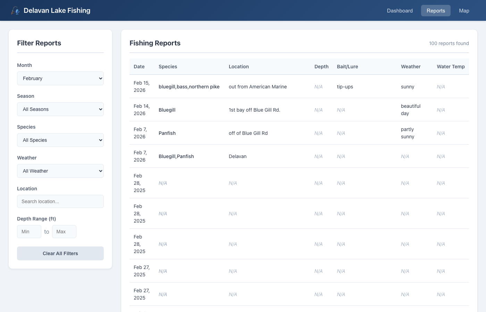

# Turning 25 Years of Fishing Reports Into Structured Data With LLMs

**How I scraped, processed, and visualized 18,594 fishing reports from Delavan Lake, Wisconsin using Python, GPT-4o-mini, and React.**

---

Delavan Lake is a 2,072-acre lake in southeastern Wisconsin known for its walleye, largemouth bass, northern pike, and panfish. For over two decades, anglers have been posting fishing reports on [Lake-Link.com](https://www.lake-link.com/) — a community-driven site where fishermen share what they caught, where, when, and with what bait.

That's a goldmine of structured fishing intelligence buried inside thousands of free-text posts. The problem? It's all unstructured. You can browse reports one at a time, but you can't ask questions like *"What bait works best for walleye in October?"* or *"What's the average water temperature when crappie are biting?"*

So I built a system to extract that knowledge automatically.

## The Problem

Lake-Link hosts **18,594 fishing reports** for Delavan Lake spanning from June 2001 to February 2026. Each report is a free-text post that may include:

- Fish species caught or targeted
- Bait and lures used
- Water depth, temperature, and conditions
- Specific lake locations (bays, weed beds, drop-offs)
- Weather and ice conditions (for ice fishing)

But none of this is structured. It's all embedded in natural language like:

> *"Got out on the south end today. Caught 15 bluegill and 3 crappie on waxies in about 8 feet of water. Ice was 10 inches. Beautiful day, sunny and 25 degrees."*

To make this data queryable, I needed to extract structured fields from every report.

## Architecture

The system has three main components:

1. **Scraper** — Authenticates with Lake-Link and crawls all historical fishing reports
2. **LLM Processor** — Sends each report through GPT-4o-mini for structured data extraction
3. **Web Application** — React frontend with a FastAPI backend for browsing and analyzing the data

```
Lake-Link.com → Scraper → SQLite (raw_reports)
                              ↓
                        LLM Processor (GPT-4o-mini)
                              ↓
                        SQLite (processed_reports)
                              ↓
                        FastAPI → React Frontend
```

## Scraping 18,594 Reports

Lake-Link uses a ColdFusion-based backend with server-rendered HTML. Reports are paginated with a `startRow` parameter, showing 10 reports per page.

The scraper uses `requests` with `BeautifulSoup` and `lxml` to parse each page. Each report lives inside a `<div id="post-id-NNNNNNN">` container with a Bootstrap card layout. The parser extracts:

- **Date** from `<strong class="text-primary"><small>` elements
- **Username** from `<h6>` tags
- **Weather/ice badges** from a flex container row
- **Report content** from `<div class="post-content">`
- **Images** from card body image tags

### Authentication and the Paywall

Unauthenticated users can only see roughly the most recent 225 posts. To access the full historical archive, you need a Lake-Link Pro account ($2.99). Authentication hits a ColdFusion JSON API:

```
POST /assets/cfcs/authenticate.cfc?method=authenticateUser
```

With a Pro account and authenticated session, the scraper was able to pull all 18,594 reports across 1,860 pages.

### Zero-Install Tooling

The project uses [pyprojectx](https://pyprojectx.github.io/) as a wrapper around [uv](https://docs.astral.sh/uv/) for dependency management. Similar to Gradle's `gradlew`, anyone can clone the repo and run `./pw install` without needing Python or uv pre-installed. The wrapper script bootstraps everything automatically.

## LLM Processing With GPT-4o-mini

Each raw report gets sent to OpenAI's GPT-4o-mini with a structured extraction prompt. The model returns JSON with the following fields:

| Field | Description |
|-------|-------------|
| `date_posted` | ISO format date |
| `month` / `season` | Numeric month and season classification |
| `species_caught` | Comma-separated list of fish actually caught |
| `species_targeted` | Fish they were trying to catch |
| `bait_lure` | Baits and lures used |
| `location` | Specific spot on the lake |
| `water_depth_feet` | Depth in feet |
| `water_temp_f` / `air_temp_f` | Water and air temperature |
| `weather_conditions` | Sunny, cloudy, rainy, etc. |
| `ice_thickness_inches` | Ice depth for winter fishing |
| `notes` | Other observations and tips |

### Why GPT-4o-mini?

GPT-4o-mini was chosen over larger models for several reasons:

- **Cost**: At $0.15/1M input tokens and $0.60/1M output tokens, processing 18,594 reports costs roughly $2-3 total
- **Speed**: Fast enough for concurrent processing
- **Accuracy**: Structured extraction from short text is well within its capabilities — this isn't a task that requires deep reasoning

The prompt provides context about common Delavan Lake species (Largemouth Bass, Walleye, Northern Pike, Bluegill, Crappie, etc.), typical locations (weed beds, drop-offs, bays), and common baits (minnows, nightcrawlers, jigs, crankbaits). This domain grounding helps the model produce consistent, accurate extractions.

### Concurrent Processing

Sequential processing at ~3 seconds per report would have taken over 15 hours. Using Python's `ThreadPoolExecutor` with 10 concurrent workers brought throughput to roughly 200 reports per minute, completing the full dataset in under 2 hours.

```python
with ThreadPoolExecutor(max_workers=10) as executor:
    futures = {executor.submit(_process_single_report, r): r["id"] for r in reports}
    for future in as_completed(futures):
        report_id, extracted, error = future.result()
        # ... insert into database
```

The processor uses `tenacity` for automatic retries with exponential backoff, handling transient API errors gracefully.

## The Frontend

The React frontend provides three views for exploring the data:

### Dashboard

The dashboard shows high-level statistics: total reports, processed count, species diversity, and current month activity. A ranked list shows the most commonly caught species, and a monthly bar chart reveals seasonal fishing patterns.



Key insights visible from the dashboard:
- **Bluegill** dominates with nearly 600 reports — the most commonly caught species on Delavan Lake
- **January** has the highest report volume (1,141 reports), reflecting strong ice fishing culture
- **Northern Pike**, **Largemouth Bass**, and **Crappie** round out the top species

### Reports Table

A filterable table lets you drill into individual reports. Filters include month, season, species, weather, location search, and depth range.



### Map View

A Google Maps integration plots fishing spots based on location data extracted from reports, with recommendations filterable by month.

## Technology Stack

| Layer | Technology |
|-------|-----------|
| **Scraping** | Python, requests, BeautifulSoup, lxml |
| **Data Storage** | SQLite |
| **LLM Processing** | OpenAI GPT-4o-mini, tenacity (retry logic) |
| **Backend API** | FastAPI, Pydantic, uvicorn |
| **Frontend** | React 19, TypeScript, Vite |
| **HTTP Client** | Axios |
| **Build Tooling** | pyprojectx + uv (backend), npm (frontend) |
| **Environment** | python-dotenv for secrets management |

## What the Data Reveals

Even with partial processing, some patterns are clear:

- **Ice fishing dominates**: January and February have the highest report counts, with bluegill and perch as primary targets
- **Bluegill is king**: By far the most reported species, caught year-round but especially during ice fishing season
- **Multi-species trips are common**: Many reports list combinations like "Bluegill, Crappie" or "Largemouth Bass, Northern Pike"
- **South end and Blue Gill Road** appear frequently as popular fishing locations
- **Tip-ups and waxies** are the go-to for winter; **crankbaits and soft plastics** dominate summer reports

## Lessons Learned

**Web scraping is fragile.** The initial scraper was written against an outdated understanding of the HTML structure. The site had been updated to use Bootstrap cards with `<div id="post-id-NNNN">` containers, requiring a complete rewrite of the parser.

**LLM extraction prompts need domain context.** Generic prompts produce inconsistent species names and miss lake-specific terminology. Providing a list of known species and location types in the prompt dramatically improved extraction quality.

**Brace escaping in Python f-strings.** The extraction prompt template contained JSON examples with `{}` braces, which conflicted with Python's `.format()` method. Every literal brace needed to be doubled to `{{}}` — a subtle bug that took some debugging.

**Concurrent API calls are essential at scale.** Going from sequential to 10-worker concurrent processing yielded a ~10x speedup with no increase in error rate.

## What's Next

- **Trend analysis**: Track species population changes over 25 years
- **Seasonal recommendations engine**: "It's October — here's what's biting and where"
- **Weather correlation**: Cross-reference with historical weather data for deeper patterns
- **Community features**: Let anglers contribute and validate extracted data

## Running It Yourself

```bash
git clone <repo-url>
cd delavan-lake-fishing-reports/backend

# Install dependencies (no pre-installed tools required)
./pw install

# Configure environment
cp .env.example .env
# Add your OpenAI API key and Lake-Link credentials to .env

# Scrape reports
./pw scrape

# Process with LLM
./pw process

# Start the API server
./pw serve
```

```bash
# Frontend
cd frontend
npm install
npm run dev
```

---

*Built with Python, React, GPT-4o-mini, and a lot of fishing reports. The entire extraction pipeline — 18,594 reports through an LLM — cost under $3 in API fees.*
